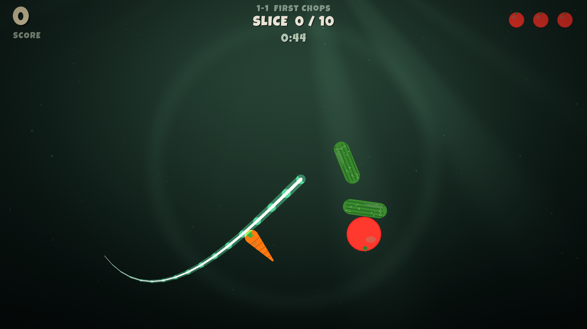

# Vegetable Ninja

A Fruit Ninja–style arcade slicing game — but with vegetables, and a
saga-style level structure: 2 worlds × 10 stages with typed objectives,
1–3 star ratings, and boss stages. Ships as a single native Windows exe
**and** as a WebAssembly web build from the same C sources. Zero external
assets: all art, sound effects and the background are generated
procedurally at startup.



## Play

Run `VegetableNinja.exe`, or serve the `web\` folder over HTTP and open it
in a browser (`python -m http.server 8377 --directory .\web` →
http://localhost:8377/ — wasm won't load from `file://`).

| Input | Action |
|---|---|
| Hold **left mouse** + swipe | Slice vegetables |
| **F11** | Borderless fullscreen (native) |
| **P** | Pause |
| **F** | FPS counter |
| **ESC** | Back to map / title / quit |

Pick a stage on the world map — stages unlock linearly, and World 2
opens after beating World 1's boss. Each stage is a finite run with one
objective: slice a count, survive the clock, hit a score, land a combo,
or make it through without cutting a bomb. Missed vegetables and sliced
bombs cost tomato lives; finishing earns 1–3 stars against per-stage
thresholds (score or slicing accuracy). Retries are free and progress
lives in memory for the session (persistence is planned). All 20 stage
definitions live in one data table (`levels.c`) — tuning the game is a
config edit, not a code change.

## Graphics

Rendering is hardware-accelerated via raylib / OpenGL 3.3 and tuned to have
headroom to spare on the Radeon 8060S (AMD Ryzen AI Max+ 395):

- The whole scene renders into a **2× supersampled** (3200×1800) render
  target for anti-aliasing on every shape, then downsamples bilinearly.
- The animated dojo background (gradient, god rays, dojo ring, film grain)
  is a **GLSL fragment shader** evaluated per-pixel on the GPU.
- A **post-process shader** applies vignette, saturation, screen flash and
  chromatic aberration (pulsed on bomb explosions).
- Additive-blended blade trail with glow, up to 4096 live juice/spark/smoke
  particles, fading splat decals, ambient dust motes, screen shake.
- Vegetable sprites are baked to mipmapped textures at startup from
  procedural raylib shape drawing.

Audio is synthesized at startup too (swoosh, splat, explosion, combo
arpeggio) — 16-bit PCM waves built sample-by-sample.

## Build

```powershell
.\build.ps1          # native exe (MinGW-w64 gcc, static raylib)
.\build.ps1 web      # WebAssembly (emcc) -> web\index.html + .js + .wasm
.\build.ps1 all      # both
```

Everything needed is vendored: raylib 5.5 MinGW binaries, raylib 5.5 source,
and the Emscripten SDK (`vendor\emsdk`). One `main.c` builds both targets;
`PLATFORM_WEB` selects the browser main loop (`emscripten_set_main_loop`),
GLSL ES 100 shader variants, and localStorage high-score persistence.

Web-build notes (hard-won, do not "simplify" away):
- raylib for web is compiled **from source** with the vendored emsdk
  (`vendor\raylib-src\...\libraylib.web.a`). The prebuilt release lib was
  built with emsdk 3.x and its miniaudio JS glue crashes on the 4.x runtime.
- `-sEXPORTED_RUNTIME_METHODS=HEAPF32,...` is required: miniaudio's Web
  Audio callback reads `Module.HEAPF32`, no longer exported by default.
- Fixed `-sINITIAL_MEMORY` instead of `ALLOW_MEMORY_GROWTH`: Chrome's
  WebGL1 `texImage2D` rejects views on resizable ArrayBuffers.
- Pointer input comes from JS handlers in `shell.html` (`Module.pointer`),
  not raylib: after raylib's resize callback changes the canvas backbuffer,
  its mouse coordinates stay in the original 1600x900 space (misaligned
  cuts). The shell CSS pins the canvas display size to the viewport with
  `!important` so CSS px == backbuffer px, and the JS handlers also give
  us touch input on mobile.
- The shell page has a fullscreen button (bottom-right); on touch devices,
  rotating to landscape arms the next tap to enter fullscreen + lock
  orientation. Open `index.html?debug` for an fps counter and a marker
  showing the game's mapped pointer position (must sit on the OS cursor).

`VegetableNinja.exe --selftest` runs a scripted session through title →
map → stage → level-complete and saves `selftest_menu.png`,
`selftest_map.png`, `selftest.png`, and `selftest_complete.png`
screenshots (used to verify the build).

Font: [Luckiest Guy](https://fonts.google.com/specimen/Luckiest+Guy)
(Apache 2.0), embedded in `font_data.h`.
